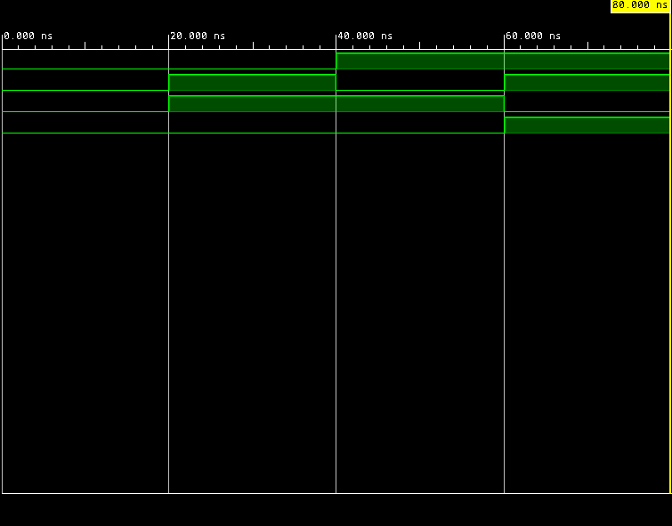
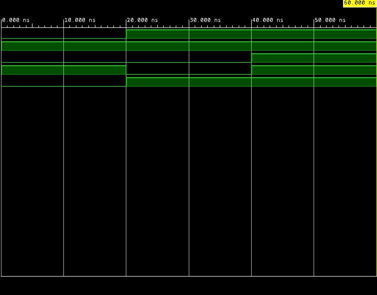
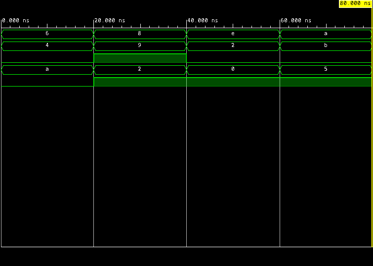
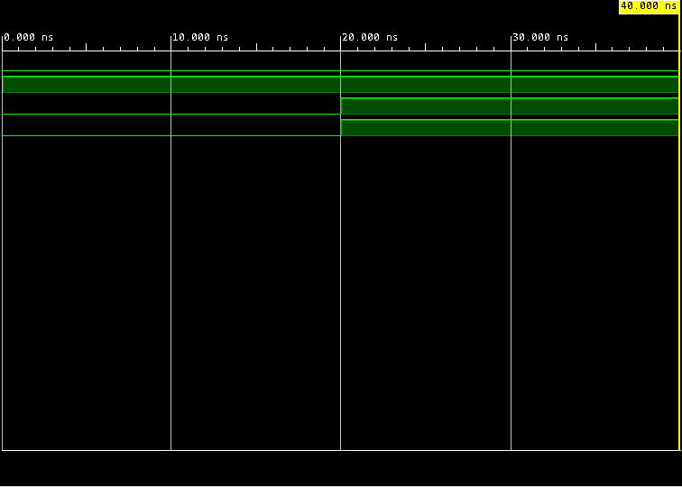
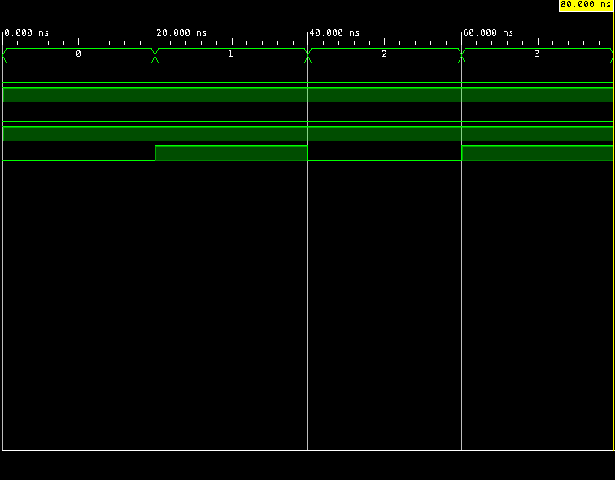

# Verilog Combinational Logic

This repository contains basic combinational logic circuits implemented in Verilog, including a half adder, full adder, 4-bit full adder, 2:1 multiplexer, and 4:1 multiplexer. Each design is verified using a testbench and simulated in Vivado, where both the waveform and expected output values are displayed in the console for verification.

## Modules

### Half Adder
Inputs: A, B  
Outputs: Sum, Cout  
Sum = A XOR B  
Cout = A AND B  

Simulation:

---

### Full Adder
Inputs: A, B, Cin  
Outputs: Sum, Cout  
Sum = A XOR B XOR Cin  
Cout = (A AND B) OR (B AND Cin) OR (A AND Cin)  

Simulation:
 

---

### 4-bit Full Adder
Inputs: A[3:0], B[3:0], Cin  
Outputs: Sum[3:0], Cout  
Ripple-carry adder built using bitwise addition with carry propagation.

Simulation:

---

### 2:1 Multiplexer
Inputs: D0, D1, S  
Output: Y  
Y = S ? D1 : D0  

Simulation:

---

### 4:1 Multiplexer
Inputs: D0, D1, D2, D3, S[1:0]  
Output: Y  
Y selects one of four inputs based on S  

Simulation:

---

## Simulation Environment
Vivado, 1ns / 1ps timescale. Each module includes a testbench that applies input combinations and displays both expected outputs and waveform results in the console and waveform viewer.